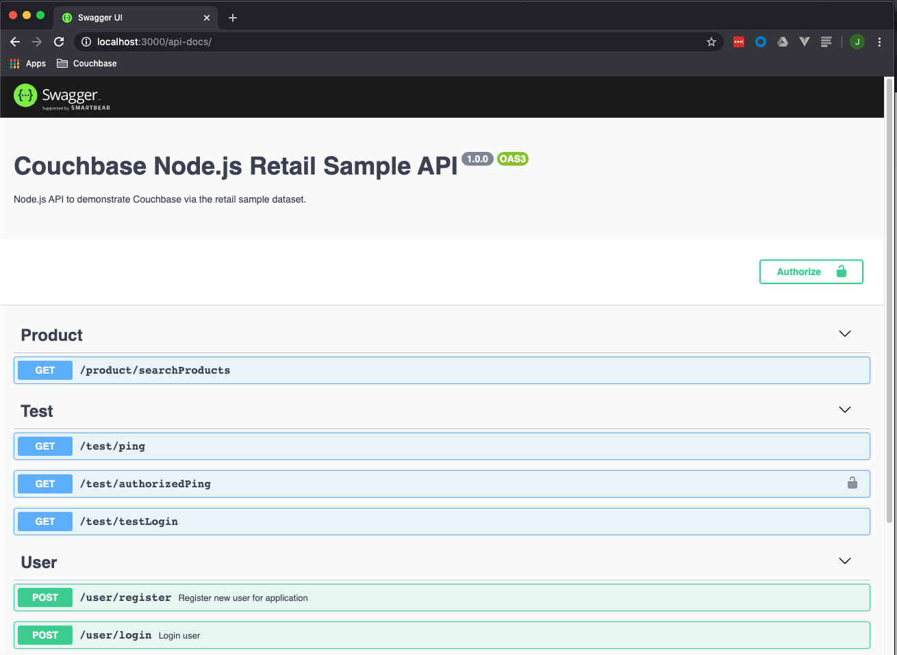
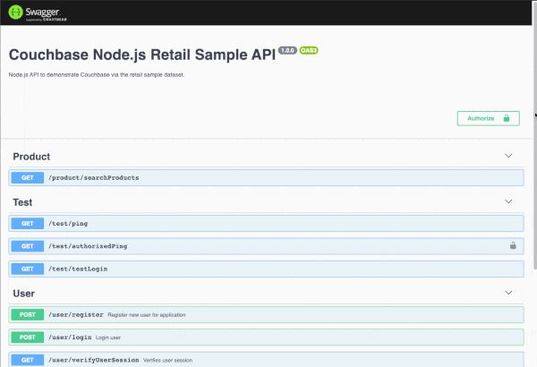

# Lab 0 - Setup

## Lab Overview

In this lab, *Docker* containers for the web UI and API will be created and started.  Follow the steps below and ask for help if stuck on a step.

>:exclamation:**IMPORTANT**:exclamation:<br> Make sure to read all IMPORTANT, REMEMBER, NOTES and DOCUMENTATION sections as important details will be provided in those sections.

## Steps

[Step 1: Create a working directory](#step-1-create-a-working-directory)<br> 
[Step 2: Setup the Web UI](#step-2-setup-the-web-ui)<br> 
&nbsp;&nbsp;&nbsp;&nbsp;[2a: Clone the web UI git repository](#2a-clone-the-web-ui-git-repository)<br> 
&nbsp;&nbsp;&nbsp;&nbsp;[2b: Create the web UI Docker container](#2b-create-the-web-ui-docker-container)<br> 
[Step 3: Create a working directory for the API labs](#step-3-create-a-working-directory-for-the-api-labs)<br> 
[Step 4: Setup Lab 0 API](#step-4-setup-lab-0-api)<br> 
&nbsp;&nbsp;&nbsp;&nbsp;[4a: Clone the API git repository](#4a-clone-the-api-git-repository)<br> 
&nbsp;&nbsp;&nbsp;&nbsp;[4b: Edit the API configuration settings](#4b-edit-the-api-configuration-settings)<br> 
&nbsp;&nbsp;&nbsp;&nbsp;[4c: Create the API *Docker* container](#4c-create-the-api-docker-container)<br> 
&nbsp;&nbsp;&nbsp;&nbsp;[4d: Verify the API *Docker* container](#4d-verify-the-api-docker-container)<br> 
&nbsp;&nbsp;&nbsp;&nbsp;[4e: Test the Couchbase connection](#4e-test-the-couchbase-connection)
<br> 

***

### Step 1: Create a working directory

Create a working directory, the directory name is up to the lab participant.  The working directory will be the directory where the repositories for the web UI and API labs reside.
>**Note:** *~/Documents/cbDevDays* is the working directory used as an example, the participant can chose/create their own working directory.  Make sure to use the same working directory throughout all the labs.

```console
$ mkdir ~/Documents/cbDevDays/
```

[Back to Steps](#steps)<br> 

### Step 2: Setup the Web UI
 
Move into the working directory created in [Step 1](#step-1-create-a-working-directory)

```console
$ cd ~/Documents/cbDevDays/
```

#### 2a: Clone the web UI git repository

*cb-dev-days-web* repository includes all resources needed to run the web UI used in the labs.  Use *git CLI* to clone the repository.

```console
$ git clone https://github.com/thejcfactor/cb-dev-days-web.git
```

Once the repository has been cloned, a *cb-dev-days-web* directory should exist in the current working directory.  Change the working directory to *cb-dev-days-web*.

```console
$ cd cb-dev-days-web
```

#### 2b: Create the web UI *Docker* container
Start a new *Docker* container for the web UI.  A brief description of the arguments provided to our *docker run* command are described below:
- **--rm**:  This option will allow the container to be removed when container is stoped
- **--name**:  optional name for the created container, we will be naming this container "web"
- **-d**:  Runs the *Docker* container in detached mode, so that control is returned to the terminal
- **-v**: This is used to map volumes. 
    + **-v /app/node_modules** is bookmarking the container’s app/node_modules directory so that it is not overwritten
    + **-v $(pwd)/:/app** is mapping the current working directory to the containers working directory.  This allows you to make changes in your host machine to code and those changes will be reflected within the container.
        > :exclamation:**IMPORTANT:**:exclamation:
        > * **$(pwd)** is for macOS and Linux operating systems
        > * If using Windows try **${PWD}** if using PowerShell, or **%cd%** if using Command Line.
        >     - We would recommend using git bash on Windows which would allow for Linux style commands
        >     - You can also use full path instead of PWD command
- **-p**: This is used for port forwarding.  We will be forwarding port 8080 in the container to port 8080 on the host<br>
    
```console
$ docker run --rm --name web -d -v /app/node_modules -v $(pwd)/:/app -p 8080:8080 thejcfactor/cbdd-web:initial-release
        
Unable to find image 'thejcfactor/cbdd-web:initial-release' locally
initial-release: Pulling from thejcfactor/cbdd-web
cbd31ae33279: Pull complete
4e8f99b4e7b4: Pull complete
777e8f2fd0f3: Pull complete
a831261d2b41: Pull complete
e78ee2a0a70a: Pull complete
327132737c89: Pull complete
d6a6a16d1425: Pull complete
7949923d73f7: Pull complete
5eec14690faa: Pull complete
a0ab7354739e: Pull complete
        
Digest: sha256:5194ceee3665ba29e1c9dfdcc26163c70198f982e5204f000b6202d55a11d697
Status: Downloaded newer image for thejcfactor/cbdd-web:initial-release
0f1b0e668f753ae757b10d26a8962efb45e8021f891fd524c9f175f176897d63
```

When the container is running, *Docker* will display a container id.
> **Note:** The container id will be different from the one in the documentation.
    
Verify that the container is running by using the following *Docker* command. 

```console
$ docker container ls --all

CONTAINER ID   IMAGE    COMMAND      CREATED         STATUS             PORTS                   NAMES  
0f1b0e668f75   thejc... "docker-e…"  13 minutes ago  Up 13 minutes      0.0.0.0:8080->8080/tcp  web

```

You can view the container logs by running the following command.  Content in the log output is truncated for display purposes in the window below, but the main point is to see the app running message below.
> App running at:<br> 
> \- Local:  http://localhost:8080/
    
```console
$ docker logs web

...

App running at:
- Local:   http://localhost:8080/

It seems you are running Vue CLI inside a container.    
Access the dev server via http://localhost:<your container's external mapped port>/

Note that the development build is not optimized.
To create a production build, run npm run build.

```

Open a browser (we recommend Chrome or Firefox...please don’t use Internet Explorer), and navigate to the web UI’s URL:  http://localhost:8080/

The following web page should be displayed.

>**Note:**  If redirected to the *Login* page, click on the "Couchbase | NoEQUAL" image in the top left corner to get to the *Home* page.


[Back to Steps](#steps)<br> 

### Step 3: Create a working directory for the API labs
Move into the working directory created in [Step 1](#step-1-create-a-working-directory)

```console
$ cd ~/Documents/cbDevDays/
```

Create a working directory for the API labs and move into that directory.

```console
$ mkdir node2x
$ cd node2x
```

[Back to Steps](#steps)<br> 

### Step 4: Setup Lab 0 API
#### 4a: Clone the API git repository
*cb-dev-days-node2x* repository includes all resources needed to run the Node.js API used in the labs. Use *git CLI* to clone the repository.

```console
$ git clone https://github.com/thejcfactor/cb-dev-days-node2x.git
```

Once the repository has been cloned, a *cb-dev-days-node2x* directory should exist in the current working directory.  Change the working directory to *cb-dev-days-node2x*.

```console
$ cd cb-dev-days-node2x
```

#### 4b: Edit the API configuration settings
Note the Node.js API’s project structure detailed in the [Appendix](#nodejs-api-project-structure).

Move to the configuration directory in order to view/edit the **config.json** file.

```console
$ cd configuration/
```

Edit the **config.json** file using your text editor of choice.

Edit the following values:
- **host** - Couchbase Server cluster hostname list.  This will be provided by the Couchbase team.

    >:exclamation:**IMPORTANT:**:exclamation: During the summit, host information will be provided.  However, if working on the labs outside of the summit and utilizing a local instance of Couchbase, use the following:
    >- MacOS:<br> 
    >&nbsp;&nbsp;&nbsp;&nbsp;**hostname**: "host.docker.internal"<br> 
    >&nbsp;&nbsp;&nbsp;&nbsp;**secure**: false<br> 
    >- Other:<br> 
    >&nbsp;&nbsp;&nbsp;&nbsp;**hostname**: "localhost"<br> 
    >&nbsp;&nbsp;&nbsp;&nbsp;**secure**: false<br> 


```json
{
  "dev": {
    "appName": "node_2x_api",
    "port": "3000",
    "database": {
      "host": "localhost",
      "secure": true,
      "bucket": "retailsample",
      "username": "svc-devdays",
      "password": "password"
    },
    "secret": "4*@L$VzRp&E%cYZDSoO^E6IPyygYpKHTXJtlOlt!zKTZF@@6l81^rJ1xmCPN%MD2",
    "sessionTTL": 300
  },
  "prod": {}
}
```

#### 4c: Create the API *Docker* container
Move back to the main API working directory.

```console
$ cd ..
$ ls -ltra

total 240
drwxr-xr-x   3 root  root     96 Sep 10 09:08 ..
-rw-r--r--   1 root  root     13 Sep 10 09:08 .dockerignore
-rw-r--r--   1 root  root   1791 Sep 10 09:08 .gitignore
-rw-r--r--   1 root  root    866 Sep 10 09:08 Dockerfile.dev
-rw-r--r--   1 root  root   1987 Sep 10 09:08 README.md
drwxr-xr-x   5 root  root    160 Sep 10 09:08 controllers
drwxr-xr-x   6 root  root    192 Sep 10 09:08 library
-rw-r--r--   1 root  root  96678 Sep 10 09:08 package-lock.json
-rw-r--r--   1 root  root    648 Sep 10 09:08 package.json
drwxr-xr-x   3 root  root     96 Sep 10 09:08 repository
drwxr-xr-x   5 root  root    160 Sep 10 09:08 resources
-rw-r--r--   1 root  root   1779 Sep 10 09:08 server.js
drwxr-xr-x   4 root  root    128 Sep 10 09:08 service
drwxr-xr-x  12 root  root    384 Sep 10 09:08 .git
drwxr-xr-x   4 root  root    128 Sep 10 09:17 configuration
drwxr-xr-x   2 root  root     64 Sep 10 09:36 node_modules
drwxr-xr-x  17 root  root    544 Sep 10 09:36 .

```

Start a new *Docker* container for the API.  A brief description of the arguments provided to our docker run command are described below:
- **--rm**:  This option will allow the container to be removed when container is stoped
- **--name**:  optional name for the created container, we will be naming this container "api"
- **-d**:  Runs the *Docker* container in detached mode, so that control is returned to the terminal
- **-v**: This is used to map volumes. 
    + **-v /app/node_modules** is bookmarking the container’s app/node_modules directory so that it is not overwritten
    + **-v $(pwd)/:/app** is mapping the current working directory to the containers working directory.  This allows you to make changes in your host machine to code and those changes will be reflected within the container.
        > :exclamation:**IMPORTANT:**:exclamation:
        > * **$(pwd)** is for macOS and Linux operating systems
        > * If using Windows try **${PWD}** if using PowerShell, or **%cd%** if using Command Line.
        >     - We would recommend using git bash on Windows which would allow for Linux style commands
        >     - You can also use full path instead of PWD command
- **-p**: This is used for port forwarding.  We will be forwarding port 8080 in the container to port 8080 on the host<br>
```console
$ docker run --rm --name api -d -v /app/node_modules -v $(pwd)/:/app -p 3000:3000 thejcfactor/cbdd-node2x-api:initial-release

Unable to find image 'thejcfactor/cbdd-node2x-api:initial-release' locally
initial-release: Pulling from thejcfactor/cbdd-node2x-api
cbd31ae33279: Already exists
4e8f99b4e7b4: Already exists
777e8f2fd0f3: Already exists
a831261d2b41: Already exists
e78ee2a0a70a: Already exists
2cceca9cefaa: Pull complete
4be2a08602ec: Pull complete
7c02142cc0bf: Pull complete
1b74b3c71fc7: Pull complete
b51933a772d5: Pull complete
4120a3913840: Pull complete
99317e52396d: Pull complete
a277f3ba3ad2: Pull complete
d2cdacc930ec: Pull complete
11391cc82c3c: Pull complete
0e694068ea02: Pull complete
Digest: sha256:7a38fa5925083a7a367bf1ce6fd136976eee72807f2abc347c05e018f5ea0fc8
Status: Downloaded newer image for thejcfactor/cbdd-node2x-api:initial-release
e3fe36fcd3436daaa7a178811e23d8a2855bc791db96068d4836c9d46ef1bb78

```

Verify that the container is running by using the following *Docker* command.

```console
$ docker container ls --all

CONTAINER ID   IMAGE    COMMAND      CREATED         STATUS          PORTS                   NAMES
0f1b0e668f75   thejc... "docker-e…"  33 minutes ago  Up 33 minutes   0.0.0.0:8080->8080/tcp  web
e3fe36fcd343   thejc... "docker-e…"  5  minutes ago  Up 5 minutes    0.0.0.0:3000->3000/tcp  api

```

View the container logs by running the following command.  The express server should be listening on port 3000.

```console
$ docker logs api

> node-26-api@1.0.0 dev /app
> nodemon

[nodemon] 2.0.3
[nodemon] to restart at any time, enter `rs`
[nodemon] watching path(s): *.*
[nodemon] watching extensions: js,mjs,json
[nodemon] starting `node server.js`
2020-04-24 02:35:34: server.js - listening on port 3000
2020-04-24 02:35:34: repository.js:connect() - connected to bucket:  retailsample

```

#### 4d: Verify the API *Docker* container
Open a browser (we recommend Chrome or Firefox...please don’t use Internet Explorer ;) ), and navigate to the API’s SwaggerUI URL:  http://localhost:3000/api-docs/

The following web page should be displayed.



The Swagger page allows you to work directly with the API.  For the remainder of the labs we will be building out the functionality for certain endpoints under the Product and User paths.

#### 4e: Test the Couchbase connection
You can verify the Couchbase connection by using the ping endpoint under the Test path on API’s Swagger page.  The ping endpoint utilizes the SDK’s health check API (Documentation [here](https://docs.couchbase.com/nodejs-sdk/2.6/health-check.html)).  Follow the steps below (see clip after output for video of steps):
1. Navigate to the SwaggerUI page: http://localhost:3000/api-docs/
2. Click on the */test/ping* endpoint
3. After the panel expands, click the *Try it out* button
4. Click on the *Execute* button
5. The response Code should be 200 and the Response body should be the following. 

```json
{
  "data": "Connected to Couchbase server.",
  "message": "Successfully pinged database.",
  "error": null,
  "authorized": null
}
```



### Appendix
#### Node.js API Project Structure
```
|—— configuration
|  |—— config.js
|  |—— config.json
|
|—— controllers
|  |—— productController.js
|  |—— testController.js
|  |—— userController.js
|
|—— library
|  |—— outputMessage.js
|  |—— verifyToken.js
|
|—— repository
|  |—— repository.js
|
|—— service
|  |—— productService.js
|  |—— userService.js
|
|—— Dockefile.dev
|—— package.json
|—— server.js
```