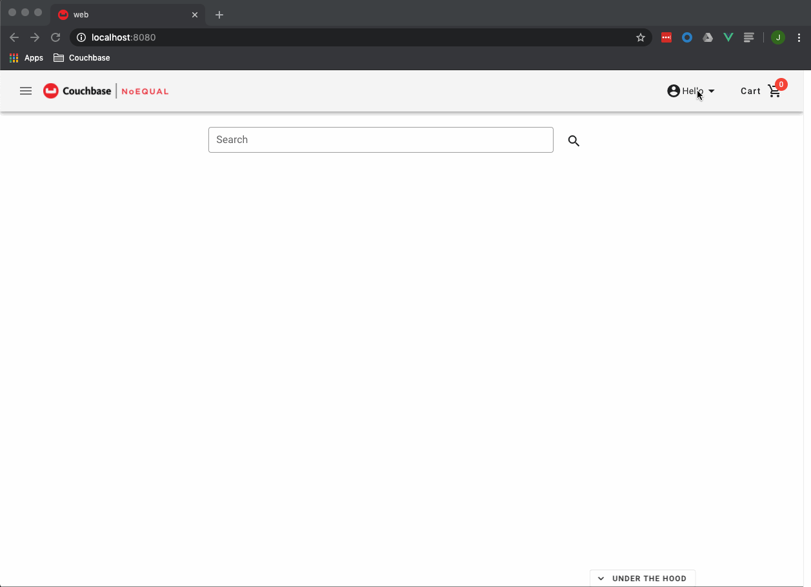
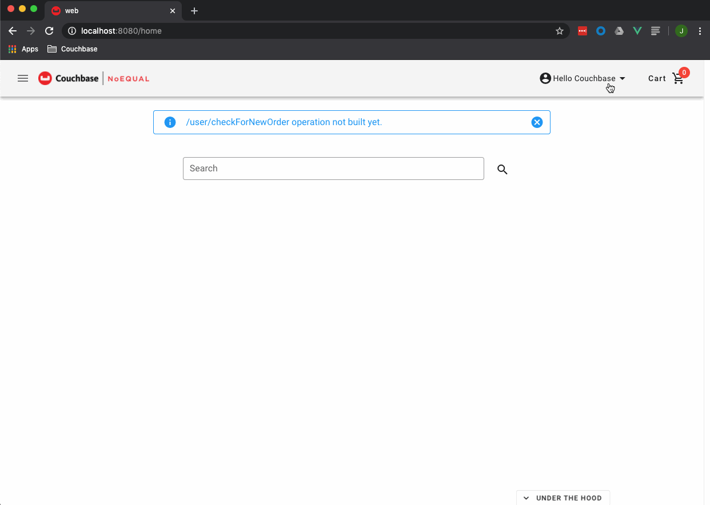

# Lab 1 - Register + K/V get

## Lab Overview

The goal of this lab is to register a new user and to retrieve a customer, utilizing Couchbase’s Node.js SDK, to perform K/V get operations.   See SDK documentation for details on using K/V operations.

>:exclamation:**IMPORTANT**:exclamation:<br> Make sure to read all IMPORTANT, REMEMBER, NOTES and DOCUMENTATION sections as important details will be provided in those sections.

<br>

[Back to Labs](./labs.md)<br> 

## Steps

[Step 1: Register and login](#step-1-regist-and-login)<br> 
[Step 2: Add Logic to API](#step-2-add-logic-to-api)<br> 

***

### Step 1: Register and login

After starting both the web UI and Node.js 2.x API, a new user can be registered.  After a successful registration, the new user can login.  Follow the steps below (also:  see clip below for steps walkthrough of steps) in order to complete the registration and login.

1. Go to http://localhost:8080
2. In the top right corner, click the *Hello* next to the user icon, a drop down menu should appear.
3. In the drop down menu, click *Sign In*, the web UI should redirect to the *Login* page.
4. On the *Login* page, click the *REGISTER* button on the bottom left of the *Login* panel.
5. Enter values for all the text fields:<br> 
&nbsp;&nbsp;&nbsp;&nbsp;a.&nbsp;&nbsp;First name - any string is valid<br> 
&nbsp;&nbsp;&nbsp;&nbsp;b.&nbsp;&nbsp;Last name - any string is valid<br> 
&nbsp;&nbsp;&nbsp;&nbsp;c.&nbsp;&nbsp;Username - any string is valid<br> 
&nbsp;&nbsp;&nbsp;&nbsp;d.&nbsp;&nbsp;Email - any string with format "example@domain.com"<br> 
&nbsp;&nbsp;&nbsp;&nbsp;&nbsp;&nbsp;&nbsp;&nbsp;&nbsp;&nbsp;i.&nbsp;&nbsp;There is no validation on if the email is real<br> 
&nbsp;&nbsp;&nbsp;&nbsp;e.&nbsp;&nbsp;Password - any string is valid<br> 
6. Click the *REGISTER* button
7. After registering, the web UI should redirect to the *Login* page.  The *Login* page should display a message at the top, outlined in green, that says “Successfully registered user.  Please login.”
8. Enter the username and password used in step #5
9. Click the *LOGIN* button
10. After logging in, the web UI should redirect to the *Home* page.  “Hello {First Name}” should be displayed in the top right corner (where {First Name} is the value entered in step #5).

>**NOTE:**  The message, outlined in blue, says “/user/checkForNewOrder operation not built yet.” is indication of an endpoint that has not been implemented.  The implementation will follow in later labs.
<br> 



[Back to Steps](#steps)<br> 

### Step 2: Add Logic to API

>**Documentation:**  SDK documentation on retrieving documents can be found [here](https://docs.couchbase.com/nodejs-sdk/2.6/document-operations.html#retrieving-full-documents).

Open the repository.js file in the API repository directory (see API’s project structure detailed in the [Appendix](#nodejs-api-project-structure)).  Search for the getCustomer() method.  The goal of this lab is to edit the getCustomer() method, using Couchbase’s Node.js SDK, to perform a key-value (K/V) look-up that returns a customer document based on a given customer document key.  See documentation reference above for SDK details on retrieving documents.

>:exclamation:**IMPORTANT:**:exclamation: The K/V get operation result object contains the document along with some other metadata.  For purposes of this lab, and all other labs, only the document contents should be returned.  Therefore, upon a successful get operation, result.value is what should be returned.

*getCustomer()* input:
- customerId:  document key for an order document
- callback

*getCustomer()* output:
- error object, if applicable
- customer document:  see [Appendix](#sample-customer-document) for a sample customer document

See the following code snippet below for a possible implementation of the *getCustomer()* method.  This, or a similar solution, can be used to implement the *getCustomer()* method logic.  

>:exclamation:**REMEMBER:**  Either comment out or replace the NOP line of code ( e.g. ```callback(null, “NOP”)``` ) with the new code created in the lab.

```javascript
 getCustomer(customerId, callback) {
   try {
     /**
      * Lab 1:  K/V operation - Get
      *  1.  Get customer:  bucket.get(key)
      */
     this.bucket.get(customerId, function(err, result) {
       if (!err) {
         let customer = result.value;
         callback(err, customer);
       } else {
         callback(err, null);
       }
     });
   } catch (err) {
     //Optional - add business logic to handle error types
     outputMessage(err, "repository.js:getCustomer() - error:");
     callback(err, null);
   }
 }

```

Notes about the code:
- Line 6:  All K/V operations are done at the bucket level for 2.x SDKs (this changes for 3.x SDKs).
  + K/V get operation parameters:
    * document key
    * callback
- Line 8:  Returning only the value of the result if there is not an error.  The lab(s) only need the document’s content to be returned.
- *outputMessage()*:  a helper method used to easily print out information to the console, method can be found in the /library directory (see API’s project structure detailed in the [Appendix](#nodejs-api-project-structure))
- try/catch & err object handling is purposefully done in a generic fashion.  The lab participant is free to add logic accordingly to test out various methods of handling errors.

Once complete, make sure the *repository.js* file is saved.  Once the code has been saved, the user profile functionality should be active within the web UI.   Follow the steps below (also:  see clip below for walkthrough of steps) in order to see the *User Profile* page.

1. Go to http://localhost:8080
2. In the top right corner, click the *Hello {First Name}* to the user icon, a drop down menu should appear.<br> 
&nbsp;&nbsp;&nbsp;&nbsp;a.&nbsp;&nbsp;If not logged in:<br> 
&nbsp;&nbsp;&nbsp;&nbsp;&nbsp;&nbsp;&nbsp;&nbsp;&nbsp;&nbsp;i.&nbsp;&nbsp;&nbsp;&nbsp;In the drop down menu, click *Sign In*, the web UI should redirect to the *Login* page.<br> 
&nbsp;&nbsp;&nbsp;&nbsp;&nbsp;&nbsp;&nbsp;&nbsp;&nbsp;&nbsp;ii.&nbsp;&nbsp;&nbsp;Enter username and password credentials<br> 
&nbsp;&nbsp;&nbsp;&nbsp;&nbsp;&nbsp;&nbsp;&nbsp;&nbsp;&nbsp;iii.&nbsp;&nbsp;Click *Login*<br> 
&nbsp;&nbsp;&nbsp;&nbsp;&nbsp;&nbsp;&nbsp;&nbsp;&nbsp;&nbsp;iv.&nbsp;&nbsp;After logging in, the web UI should redirect to the *Home* page.  Go back to the beginning of step #2<br> 
3. In the drop down menu, click *User Profile*, the web UI should redirect to the *User Profile* page.



[Back to Steps](#steps)<br> 

### Appendix
#### Node.js API Project Structure

```
|—— configuration
|  |—— config.js
|  |—— config.json
|
|—— controllers
|  |—— productController.js
|  |—— testController.js
|  |—— userController.js
|
|—— library
|  |—— outputMessage.js
|  |—— verifyToken.js
|
|—— repository
|  |—— repository.js
|
|—— service
|  |—— productService.js
|  |—— userService.js
|
|—— Dockefile.dev
|—— package.json
|—— server.js
```

[Back to Overview](#lab-overview)<br> 

#### Sample Customer Document

```json
{
  "doc": {
    "type": "customer",
    "schema": "1.0.0",
    "created": 1559780511352,
    "createdBy": 195,
    "modified": 1587833486406,
    "modifiedBy": 702
  },
  "_id": "customer_100",
  "custId": 100,
  "custName": {
    "firstName": "Hilton",
    "lastName": "Schinner"
  },
  "username": null,
  "email": "Karianne39@gmail.com",
  "createdOn": "2019-06-08",
  "address": {
    "home": {
      "address1": "4810 Hegmann Manors Burgs",
      "city": "North Ivahfort",
      "state": "WY",
      "zipCode": "01961",
      "country": "KG"
    },
    "work": {
      "address1": "198 Molly Mountain Plains",
      "city": "South Clifton",
      "state": "CT",
      "zipCode": "77161",
      "country": "SA"
    }
  },
  "mainPhone": {
    "phone_number": "682126158733138",
    "extension": null
  },
  "additionalPhones": {
    "type": "Other",
    "phone_number": "987601914834116",
    "extension": null
  }
}

```

[Back to Overview](#lab-overview)<br> 
